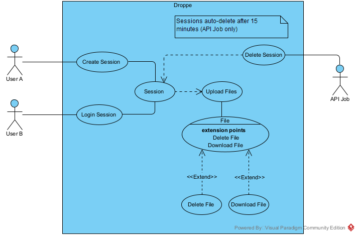

API para **upload, download e gerênciamento de arquivos**, permitindo a **transfêrencia segura** entre cliente e servidor. Arquivos **salvos de forma temporária** em nossa base de dados.

## Visão Geral

- Download de arquivos
- Upload de arquivos
- Gerenciamento básico de arquivos
- Sessões, arquivos e registros temporários
- Criação de sessão com código de acesso único
- Login em sessões
- API Job para deleção de dados

###



## Tecnologias utilizadas

<div align="left">
  
  
  
  
  
  
  
</div>

###

## Estrutura do projeto

```
Droppe
├── assets
├── docs
├── package-lock.json
├── package.json
├── prisma
├── prisma.config.ts
├── readme.md
├── src
│   ├── controller
│   ├── errors
│   ├── index.ts
│   ├── lib
│   ├── middlewares
│   ├── routes
│   └── services
└── tsconfig.json

```